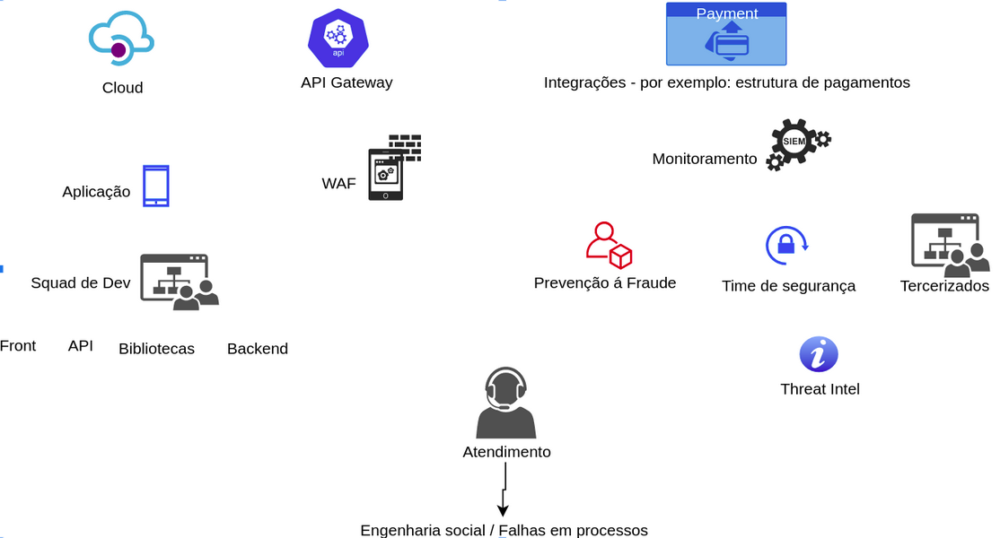

## Checklists

Security Consulting project analyzing a software product

### API

Check JWT token data (key, inserted data and token);
Check the JWT token algorithm to prevent the use of the “none” technique;
Avoid control mechanisms implemented exclusively on the client side;
Check files uploaded in the upload mechanism (in this case, allow only images to be sent);
Protect information in transit (e.g. using HTTPS);
Validate access control to avoid escalating privileges;
Store uploaded files securely;
Expose only what is necessary to the Internet;
Implement anti-automation mechanisms
Do not allow API calls in an unauthenticated;

### Mobile

Employ anti-automation mechanisms in authentication and in features considered critical;
Minimize the attack surface, exposing only what is necessary to the Internet;
Functionalities should be designed with the aim of avoiding enumerations of users, technologies used, or any resources that could serve as input for attacks;
Ensure unpredictability and expiration of session or integration tokens;
Use measures such as Certificate Pinning, IP whitelist or mutual authentication, to mitigate attacks on information in transit and other abuses;
Do not allow "normal" application execution on devices with Root, Jailbreak, or Developer mode enabled;
Employ source code obfuscation;
Use robust technology for unique device identification, and device fingerprint management;
Application must not allow backup of your files;

Remove as much sensitive information from the client-side (cache, log, PList files, shared_prefs, etc.).

### General recommendation

Check JWT token data (key, inserted data and token);
Check the JWT token algorithm to prevent the use of the “none” technique;
Avoid control mechanisms implemented exclusively on the client side;
Check files uploaded in the upload mechanism (in this case, allow only images to be sent);
Protect information in transit (e.g. using HTTPS);
Validate access control to avoid escalating privileges;
Store uploaded files securely;

### WAF / API Gateway / Sistema de Logs / etc

Logs with data with sensitive information;
    passwords
    cards
    PII
Access review;
    ACL - groups - adm and operators / users / password policy
Administrative panel
    Exclusive for administrators and operators only
    Enumeration
    Brute force
    Forgot password functionality
Rules review;
    AllowLists
    Continuous maintenance and adjustments of

### Aplicação

Track libs / dependencies;
Training of developers;

### Onboarding

Track data and user actions;
Verification of user data - Documentation, photos, Device fingerprint etc;
Robust multi-stage registration - balance with the usability team *.

### SOC

Monitoring all points of the application and its infrastructure
Well-defined playbook;
Escalation of events
Well-defined recovery plan;

WIP

### Sec squad

### Threat Intel squad

### Dev squad

### Motor Antifraude / Orquestrador

### Squad Fraud prevention

### Client's support

### Payment integrations

### Cloud

### Third-party squad

### Links

Software Security Architecture Review

Abordagens de Prevenção à Fraude e Segurança

OWASP In SDLC

Gitbook Mobile Testing guide

Web testing guide

Techniques

SAMM

OWASP Application Threat Modeling

gitbooks
https://mobile-security.gitbook.io/mobile-security-testing-guide/
https://vulp3cula.gitbook.io/hackers-grimoire/exploitation/web-application
https://scriptingxss.gitbook.io/embedded-appsec-best-practices/threat-model
